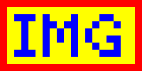
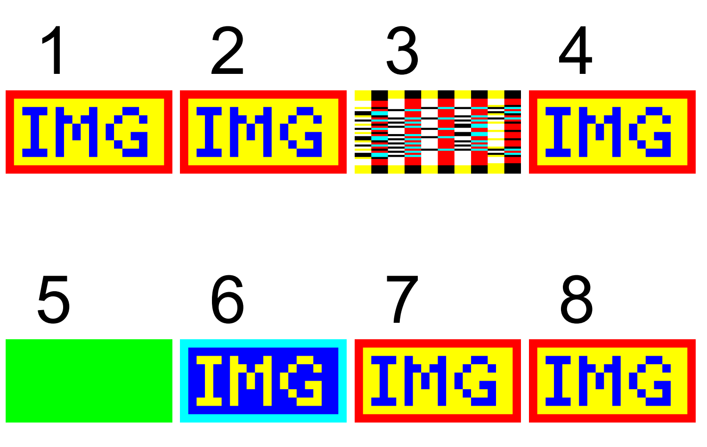
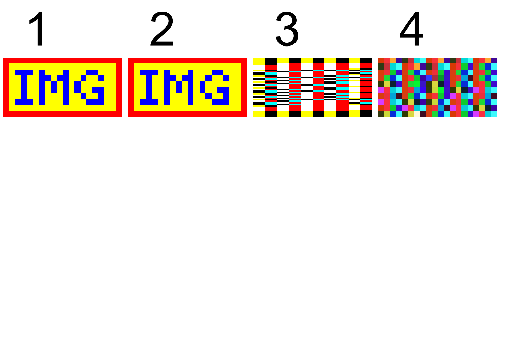
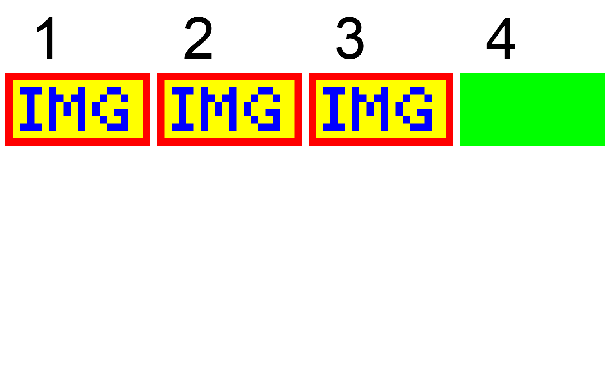
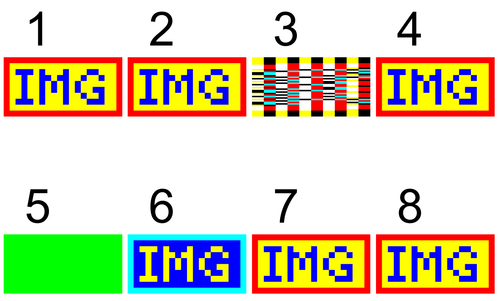
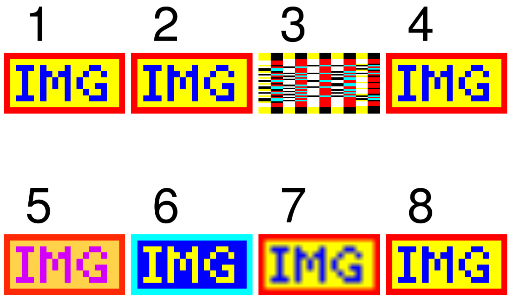
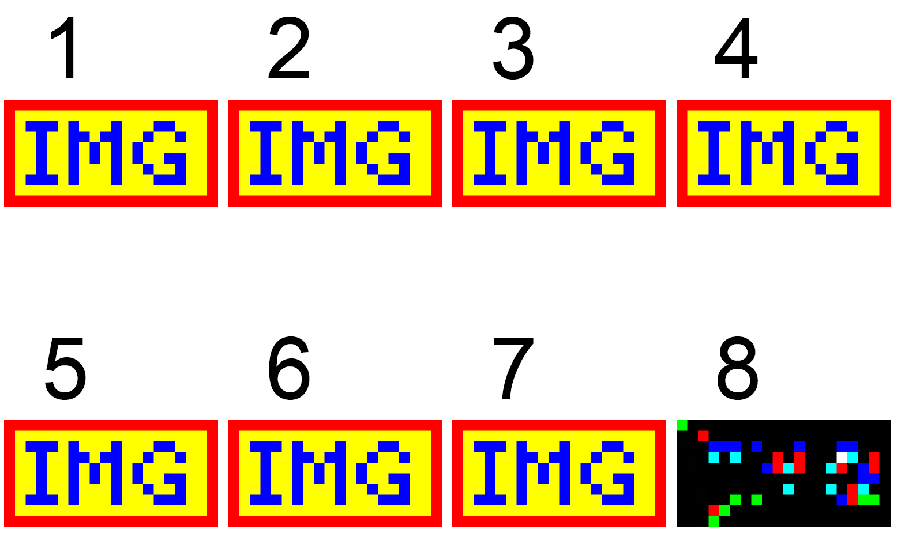

# Inline image abbreviated and full key names

The follow inline image key name abbreviations are defined in "Table 91 - Entries in an inline image object" of the PDF 2.0 specification:

| Full Name | Abbreviation |
| --------- | :----------: |
| `BitsPerComponent` | `BPC` |
| `ColorSpace`       |  `CS` |
| `Decode`           |  `D` |
| `DecodeParms`      |  `DP` |
| `Filter`           |  `F` |
| `Height`           |  `H` |
| `ImageMask`        |  `IM` |
| `Interpolate`      |  `I` (uppercase I) |
| `Length` (_PDF 2.0_) |  `L` |
| `Width`            |  `W` |

All PDF specifications and standards, including [ISO 32000-2:2020](https://www.iso.org/standard/75839.html) (PDF 2.0) have no statements about how PDF processors should behave if both a full key name and the matching abbreviated key name are present in a psingle inline image dictionary.

This was raised as [GitHub pdf-issue #3](https://github.com/pdf-association/pdf-issues/issues/3) and resolved by the [addition of the following statement to clause 8.9.7](https://www.pdfa.org/proxy.php/https://pdf-association.github.io/pdf-issues/clauses/clause08) in ISO 32000-2:2020 (PDF 2.0):

> "In the situation where both an abbreviated key name and the corresponding full key name from Table 91 are present, the abbreviated key name shall take precedence."

The inline image syntax constructs used in this PDF 2.0 test file use the following rules:
* they are all valid according to ISO 32000-2:2020 (PDF 2.0) - hence they all have the `/Length` or `/L` key
* they are otherwise self-consistent for both the all-full and all-abbreviated key interpretations
* beneath each image (in Z-order) is a green coloured rectangle to assist in identifying any rendering issues. If you see a green rectangle then that is a **FAIL!**
* key values for keys not being tested are valid and correct for the image data provided
* the image is natively 20 x 10 pixels, 8 bit RGB, and always less than 4KB in the PDF file (meeting inline image requirements). It is also therefore heavily up-scaled.

This test PDF contains 8 individual test cases for various sets of full and abbreviated keys, as it should not be assumed that PDF processors might do "all full keys" or "all abbreviated keys". Each test case:

1. Baseline. Only full key names are used - _all PDF processors should support this!_
2. Baseline. Only abbreviated key names are used - _all PDF processors should support this!_
3. The `/Width` and `/Height` keys have different (incorrect) values compared to `/W` and `/H`.
4. The `/Filter` key is being tested with an incorrect value for the inline image data (whereas `/F` is correct). This also likely means the inline image pixel data will confuse the PDF parser and it may not be able to process further test cases.
5. The `/ColorSpace` key uses an extreme `CalRGB` colorspace which will make the image appear different in failing processors, whereas `/CS` uses `/RGB` (DeviceRGB)
6. The `/Decode` array is the linear inverse of `/D` and thus the image will display differently in failing processors.
7. The `/Interpolate` key is true and, for those processors that support image interpolation, the image will display differently in failing processors.
8. The `/DecodeParms` key is missing key information which will make the image display differently in failing processors.

Correct output is the same image in all 8 locations.

The PDF 2.0 test file is a pure text file with comments. By commenting out a few lines in each test case, the image can be visualised as to what failing might look like.

In some cases, PDF processors may struggle to recover from content stream errors and display all 8 test cases. In these cases, it is recommended to comment out the triggering inline image key(s) of the last visible test case and see if the PDF processor will then processor more of the PDF.

Here is the output from some failing viewers:

And if test 4 is nullified (i.e. it is converted to a valid inline image by commenting out this line `% /Filter [/A85]` by changing the first `SPACE` to a `%`), then this showed more failures:

___
*This material is based upon work supported by the Defense Advanced Research Projects Agency (DARPA) under Contract No. HR001119C0079. Any opinions, findings and conclusions or recommendations expressed in this material are those of the author(s) and do not necessarily reflect the views of the Defense Advanced Research Projects Agency (DARPA). Approved for public release.*
